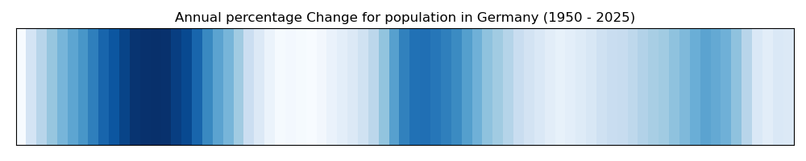

# Warming Stripes
Example to demonstrate executable nano publications:

- Nanopublication related to warming stripes 1950 - 2019, Freiburg (Germany): https://w3id.org/np/RAnqaMx3Ri3bR8yY3oiM-BeMJf8LPxidTSqyEpcHyXoLc

*Freiburg's temperature anomaly data (1950-2019) was plotted with a replicable workflow as warming stripes, revealing a marked shift from blue (colder) to red (warmer) that demonstrates accelerating local warming.*

- This nanopublication is an AIDA sentence that is supported by a figure (see below) and associted dataset and workflow:


## Step 1: Get the workflow from an executable nanopublication

```
python galaxy_rocrate_finder.py https://w3id.org/np/RAnqaMx3Ri3bR8yY3oiM-BeMJf8LPxidTSqyEpcHyXoLc downloaded_rocrate
```

If the rocrate is found it is downloaded in `downloaded_rocrate`.


## Step 2: Prepare inputs and parameters 

This step will generate `workflow.ga` (exact copy of the workflow in the RO-Crate) and prepare the input parameters `workflow_input_params.yml` using data from the RO-Crate:
```
python prepare_inputs_and_parameters.py  9d075312-2f7b-4d24-850c-6cd3b3f1cd8a.zip  downloaded_workflows
```

## Step 3: Run workflow with prepared inputs and parameters

Below we use planemo to send the data from the RO-Crate (copied locally) to Galaxy and execute the worfklow on the chosen galaxy instance:

```
planemo run workflow.ga workflow_input_params.yml --engine external_galaxy --galaxy_url https://usegalaxy.eu  --galaxy_user_key $GALAXY_API_KEY --history_name ScienceLive
```

This step assumes the tools used in the workflow are available in the selected Galaxy instance.

## Step 4: Generate Markdown for new RO-Crate (optional)

```
python extract_md_from_galaxy_rocrate.py
```

## Step 5: Change inputs and rerun the workflow

Now we have shown the reproducibility of a workflow from a nanopublication containing an executable RO-Crate.

`workflow.ga` should not be changed. However, you can change `workflow_input_params.yml` for instance change the parameters for the stripes (name of the column to use for plotting, color, etc.) and/or change the input file too.

### Change input datasets and parameters

- We will use the same workflow but for a different dataset and with a different colormap. For instance, to show the variation in the Annual percentage Change in popultation in Germany from 1950 to 2025.

- **Source of data**: [Germany Population 1950-2025 (Macrotrends)](https://www.macrotrends.net/global-metrics/countries/deu/germany/population)

- Update the file `workflow_input_params.yml`: 

```
files.tabular:
  class: File
  path: population/Germany-Population-Annual--Change-2025-05-27-15-17.csv
  filetype: csv
Column name to use for plotting: "Population"
Plot Title: Annual percentage Change for population in Germany (1950 - 2025)
nxsplit: null
xname (column name for the x-axis): null
Date/time format for the x-axis column: null
dates format for xlabels: null
Matplotlib colormap: Blues
```

Then we can run the workflow: 
```
planemo run workflow.ga workflow_germany_params.yml --engine external_galaxy --galaxy_url https://usegalaxy.eu  --galaxy_user_key $GALAXY_API_KEY --history_name ScienceLive-Population-Germany
```

The resulting figure is shown below:



From this Figure, we can create a new AIDA sentence with supporting material (RO-Crate). For example, the corresponding AIDA sentence could be:

*Germany’s population growth has varied over time, reflecting key historical events. Periods of increase, such as the post-war baby boom and labor migration in the 1960s, contrast with years of stagnation or decline, especially after reunification. More recent rises are linked to immigration and refugee inflows. The trend reveals how population change closely mirrors social and political shifts across decades.*

## Step 6: Create RO-Crate and archive or snapshot in ROHub (optional)

We can create a RO-Crate and then archive it in ROHub:

```
python create_rocreate_rohub.py --galaxy_url https://usegalaxy.eu  --galaxy_user_key $GALAXY_API_KEY --history-id xxxxxx
```


